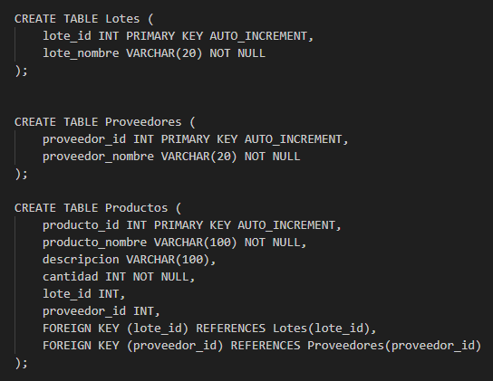

# Proyecto API en C# .NET

Este proyecto es una API desarrollada en C# utilizando el Framework .NET. Provee endpoints para control de inventario, conteniendo como base los productos, proveedores y lotes. 

## Requisitos

- .NET SDK 6.0 o superior
- Visual Studio 2022 o superior (opcional)
- SQL Server o MySql

### Paquetes NuGet utilizados
- Microsoft.AspNet.Cors 5.3.0
- Microsoft.EntityFrameworkCore 8.0.6
- Microsoft.EntityFrameworkCore.SqlServer 8.0.6
- Microsoft.EntityFrameworkCore.Tools 8.0.6

## Instalación

1. Clona el repositorio:

    git clone https://github.com/anap011/project_inventory_management-api.git
    
    cd project_inventory_management-api

2. Restaura los paquetes NuGet:

    dotnet restore

3. Configura la conexión a la base de datos en el archivo `appsettings.json`:

    

6. Ejecuta la aplicación:

    dotnet run

## Creación de la base de datos con SQL :

## Guía de Uso

El URL : https://www.api-inventory-management.somee.com/v1

La API ofrece los siguientes endpoints:

### Productos

- **GET /productos**: Obtiene todos los productos.
- **GET /productos/{id}**: Obtiene un producto por su ID.
- **POST /productos/**: Crea un nuevo producto.
- **PUT /productos/{id}**: Actualiza un producto existente.
- **DELETE /productos/{id}**: Elimina un producto.

### Proveedores 

- **GET /proveedores**: Obtiene todos los proveedores.
- **GET /proveedores/{id}**: Obtiene un proveedor por su ID.
- **POST /proveedores**: Crea un nuevo proveedor.
- **PUT /proveedores/{id}**: Actualiza un proveedor existente.
- **DELETE /proveedores/{id}**: Elimina un proveedor.

### Lotes 

- **GET /lotes**: Obtiene todos los lotes.
- **GET /lotes/{id}**: Obtiene un lote por su ID.
- **POST /lotes**: Crea un nuevo lote.
- **PUT /lotes/{id}**: Actualiza un lote existente.
- **DELETE /lotes/{id}**: Elimina un lote.

## Links de los respositorios que complementan este proyecto = 

https://github.com/anap011/project_inventory_management-web_api

https://github.com/anap011/project_inventory_management-web_crud

https://github.com/anap011/project_inventory_management-backend_login
